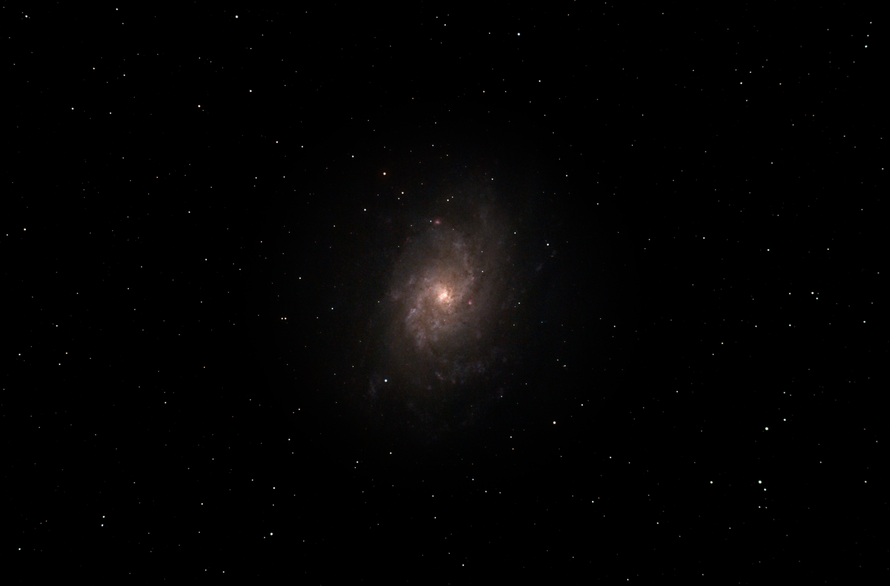
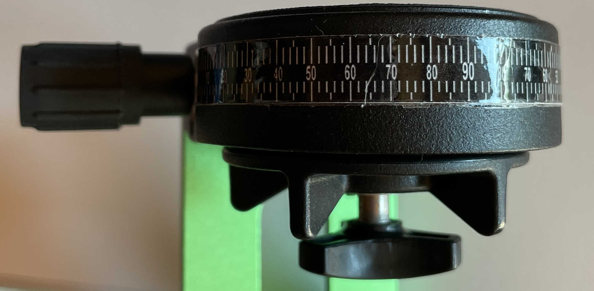
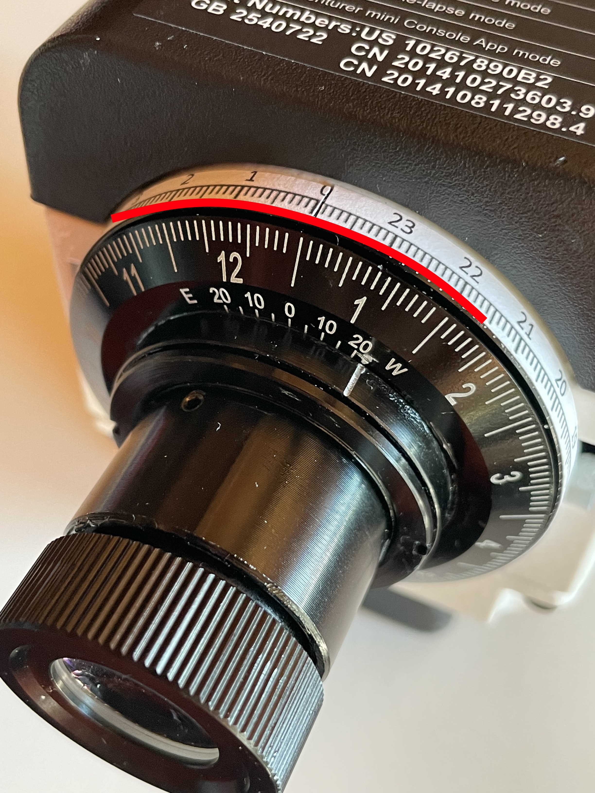
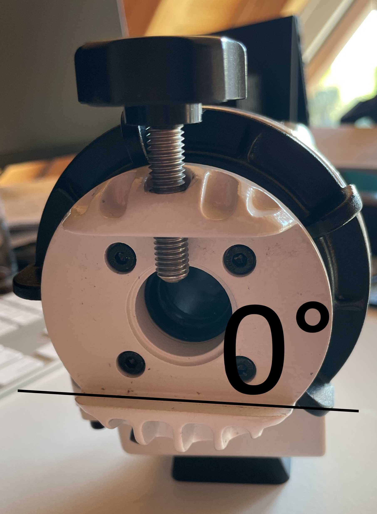
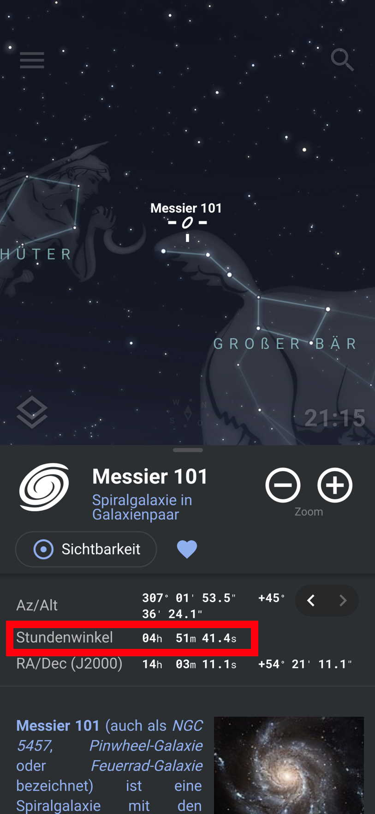
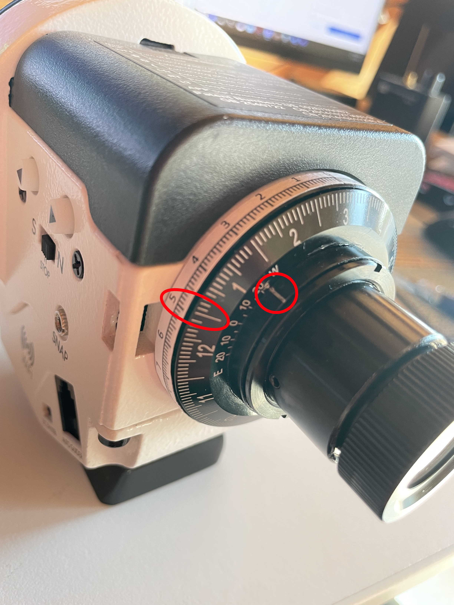
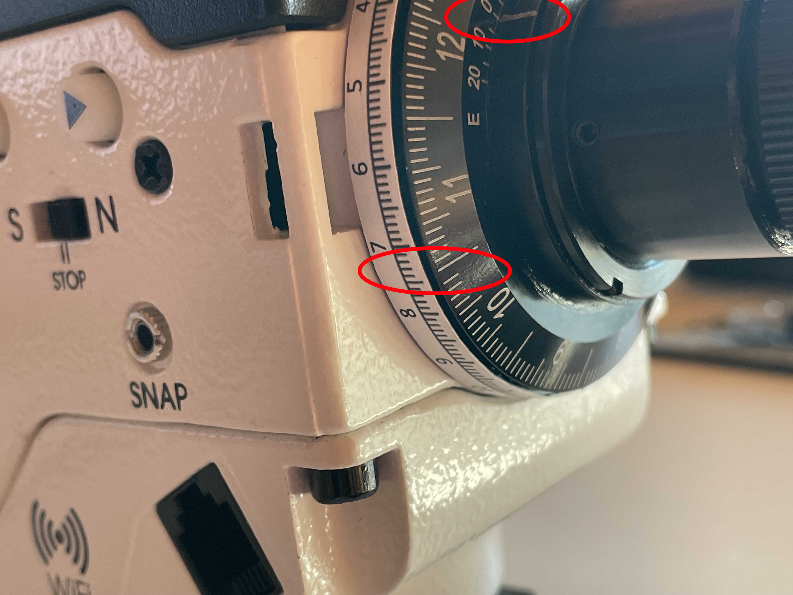
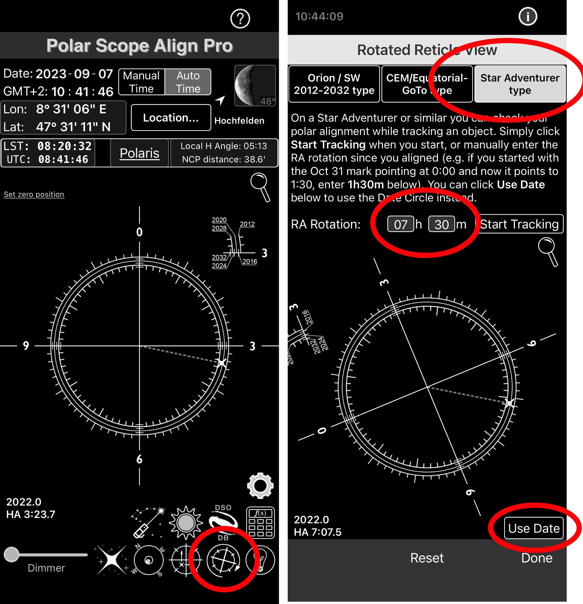

# LivePlateSolver
LivePlateSolver supports your SkyWatcher Adventurer capturing session by live plate solving star images and giving advice how to perfectly center your target. It can be cumbersome to find a small or dark object in the skies with starhoping if you are using a telescope with a bigger focal length (e.g. 420mm). I once spent 2 hours looking for the Crescent Nebula and I don't want to repeat this experience anytime again. Some say i'm still looking for it... As soon as you get in the range of the object this tool will tell you how to manipulate your SkyWatcher Adventurer to center it. 



# Preparation

## PlateSolver2 (required)
Install PlateSolver2 and download a starset (https://planewave.com/software/). Configure the Starset in the settings of PlateSolver2 and make some testruns before use.

## Skywatcher Adventurer Mods

Usually with Star Adventurer you do starhopping until you have found the object you want. This is fine as long as you have a lower focal length or your object is easy visible. Im using a 420mm SkyWatcher 72ED and with my APS-C Crop Sensor it is quite difficult sometimes to find and center faint targets like galaxies or nebulas. The steps provided below are a way for easier stellar navigation without star hoping.

Altough this steps are not needed to use this tool, its recommended. The nearer you can initially navigate to the target, the faster plate solving will be. Also if you are pointing to far away, Plate solving might not work.

### Declination Scale
You should add a declination scale to your Adventurer (available in this great video: https://www.youtube.com/watch?v=tNPIMKOB9k4&t=228s). It allows you to point your telescope at a given declination.



### Time Graduation Scale
Put a correct scale over the default Time Graduation Circle (RA-scale.pdf). On my model, the scale's size seems wrong (6 and 12 are not 180° apart). The scale goes around the clock which is more convenient than the default scale.



### Level out the mounting Plattform
Release the clutch and turn the plattform to "level it out" at 0°. If you put a leveler into the mount it must be paralell to the ground.



Move the Date Graduation Circle so that 1/1 stays at 00:00 of the Time Graduation Circle. Now make a mark on the Date Graduation Circle where the Time Meridian Indicator is.


If you now turn the mounting plattform you can set a any hour angle (set 1/1 to desired hour angle), as long as the Time Meridian Indicator is still pointing to your own mark. This value is available in Stellarium and depends on your position and current time. Don't confuse it with right ascension.

In this example I take the Pinwheel Galaxy Hour Angle 04:51 from Stellarium.


Release the clutch and rotate the platform until 1/1 on the date scale is aligned with 04:51 on the Time Graduation scale. Make sure the your own mark matches the Time Meridian Mark on the inner Ring.



### Some Sort of Capturing Software
This tool works by monitoring a directory where new images are stored from your camera. You can simply Copy&Paste them into the folder or also use your favourits camera controller directory.

There is support for automatically converting *.cr2 raw images to jpg to feed PlateSolver2.

## PS Align Pro (recommended)
I use this [app](https://apps.apple.com/us/app/polar-scope-align-pro/id970161373) to adjust polar alignment after moving the telescope by hand. Usually the mount gets shifted a bit and polar alignment will move as well. This procedure only works if the Star Adventurer is leveled out at the beginning.
- After changing the Telescopes position, the crosshair usually is rotated, making it hard to decide where Polaris must be in the Circle
- Move the Date Graduation Circle so the Time Meridian Indicator is lined up with 0° on the Date Graduation Circle

- Find the corresponding Time on the Time Graduation Circle where Oct 31 is. (In this sample the rotation time is 07:30)
- Open PS Align Pro App and open the Rotated Reticle View. Choose Star Adventurer Type on top right, and "Use Hours" at the bottom right. Enter the Time (where Oct 31 is lined up) into the RA Rotation and the crosshair in the app will exactly show what you see in the polar scope.

- Align your mount to fit polaris at the correct position


# Usage
1. Roughly Polar align your Skywatcher Adventurer and setup your gear.
    - Make sure it is perfectly leveld out, since this allows you to easily readjust polar alignment even in rotated state (using PS Align Pro)
    - Initial Polar Alignment must not be perfect, as I always do the detailed Polar Alignment after aligning the telescope.
2. Have a laptop ready, ideally connected to the camera
3. Choose a target and find its RA/Dec Values with a starfinder
    - Lets choose Pinwheel Galaxy: RA 14h 03m 12s | +54° 20' 27"
4. Move your telescope into the range of the target
5. After moving the telescope by hand, i usually have to check polar alignment. Use PS Align Pro for easy alignment in rotated state
5. Start the Program
    ```
    .\LivePlateSolver.exe `
        --right-ascension 14:03:12 `
        --declination 54:20:27 `
        --monitor c:\\Users\\Someone\\Pictures\\Pinwheel `
        --focal-length 620 `
        --width 22 `
        --height 15 `
        --regions 200 
    ```
    Submit RA and Dec are in time notation. They can be negative.

    Focal Length should be adjusted with Reducer and Crop factor. My telescope is 420mm, i have a 0.85 reducer and a APS-C Sensor (1.6x) so it adds up to 571. Its just an estimation, however if its totally wrong platesolving wont work.

    Width and Height is the Camera Sensors size in mm.

    The more regions you check, the longer it might take and the bigger the tolerance is. PlateSolver2 starts solving in a spiral way from the target, so if you are near the target it will resolve pretty fast.

5. The Program will tell you that it started monitoring the directory for new images
6. Make a photo with your mounted camera, pointing somewhere roughly into the direction of the pinwheel galaxy.
    - The foto must not be long exposured. Usually some seconds are enough to find some bright stars.
7. Put the photo into the folder (or have it put there by a camera remote controll software)
8. The Programm will invoke PlateSolver2 with need parameters and evaluates its output. It will give you some advice how to proceed:

```
Waiting 5000ms before processing file to avoid file system errors.
Calling PlateSolve2.exe 3.679154063204047,0.9485767521852959,0.03548648475909761,0.024195330517566553,500,C:\Users\Someone\Pinwheel\DSC_0002.jpg,1
Center Coordinate: 
    RA: 13:52:16.7215557
    Dec: 50° 11' 22"

Compensation (SkyWatcher Adventurer):
    RA: 00:10:55.2784442 => Press left button 55 seconds
    Dec: (4, 9, 35) => turn declination knob 1.39 counter-clockwise

```

After pressing the left manual move button on the Skywatcher and turning the mounting plattform 1.4 times, make a new photo and let it plate solve again. Pinwheel Galaxy should be now near your images center, you might need to repeat again.
